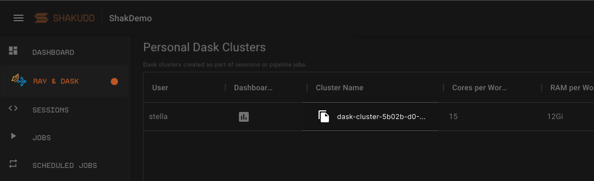

# Dask
[Dask](https://dask.org/) is a flexible open source distributed framework for parallel computing. It has similar APIs to Numpy and Pandas, is an ideal choice for parallelizing Numpy, Pandas and List based code.

## Notebook_Common
`notebook_common` is part of the Shakudo Platform Hyperplane API that contains convenience functions for Dask and pipeline jobs.
It contains functions to manage Dask clusters, pipeline jobs, and Slack messages, and GraphQL operations.

## `quickstart_dask()`

Use `quickstart_dask` to quickly spin up a Dask cluster using t-shirt sizes. Returns a tuple [Client, KubeCluster].

```python
from hyperplane.notebook_common import quickstart_dask
client, cluster = quickstart_dask(
    num_workers = 4, 
    size = 'hyperplane-med-high-mem'
)
```

**Parameters**

| Name             | Type         | Description    |
| :----------------| :----------- | :--------------------------------------------- |
| num_workers   <div class="label basic required">Required</div>  | integer      | Number of workers  |
| size          <div class="label basic required">Required</div>  | string       | [Pre-configured worker pools](#worker-pools)    |  

<br />

<a name="worker-pools"></a>

**Pre-configured Worker pools**

The preconfigured worker pools are the following

| Name                          | Worker Pool  | Allocatable cores    | Allocatable ram     |
| :-----------------------------| :----------- | :------------------- |:------------------- |
| hyperplane-xs-high-mem        | POOL_4_32    | 3.5                  |7.0                  |
| hyperplane-small              | POOL_8_8     | 7.0                  |5.0                  |
| hyperplane-small-mid-mem      | POOL_8_16    | 7.5                  |12.0                 |
| hyperplane-small-high-mem     | POOL_8_64    | 7.5                  |58.0                 |
| hyperplane-med                | POOL_16_16   | 15.0                 |12.0                 |
| hyperplane-med-mid-mem        | POOL_16_32   | 15.0                 |27.0                 |
| hyperplane-med-high-mem       | POOL_16_128  | 15.0                 |110.0                |
| hyperplane-large              | POOL_32_32   | 28.0                 |27.0                 |
| hyperplane-xxl-high-mem       | POOL_96_768  | 94.0                 |675.0                |


---

## `initialize_dask_cluster()`

Initialize a distributed DASK cluster. Returns a tuple [Client, KubeCluster]. You may use the returned client and cluster like any other dask cluster.

```python
from hyperplane.notebook_common import initialize_dask_cluster
client, cluster = initialize_dask_cluster(
    num_workers:int=2, 
    local_mode:bool=False, 
    worker_spec_yaml:str=WORKER_SPEC_TEMPLATE_1_1, 
    timeout:int=1200, 
    nthreads:int=1, 
    nprocs:int=15, ram_gb_per_proc:float=0.7, 
    cores_per_worker:int=15, 
    scheduler_deploy_mode:str="remote", 
    dashboard_port:str="random", 
    logging:str="quiet" 
  )
```

** Parameters **

| Name                  | Type      | Description    |
| :---------------------| :---------| :--------------------------------------------- |
| num_workers           | integer   | (Default value: 2) Number of Dask worker nodes.  |
| local_mode            | bool      | Whether to use local cluster or distributed KubeCluster   | 
| worker_spec_yaml      | string    | A string yaml for cluster configs    | 
| timeout               | integer   | Time limit (seconds) for a scheduler to wait to connect before returning a timeout error   | 
| nthreads              | integer   | Number of threads per worker in your cluster    | 
| nprocs                | integer   | Number of processes per worker in your cluster    | 
| ram_gb_per_proc       | float     | GB of Ram per process, per worker  | 
| cores_per_worker      | integer   | Number of cores per worker    | 
| scheduler_deploy_mode | string    | Where to deploy the scheduler (remote in its own worker, or locally in jhub). Choose remote when the Dask graph   | 
| dashboard_port        | string    | Choose a port number for your dashboard, or leave as "random" to have a random port, which will not conflict  | 
| logging               | string    | Logging level for printouts when initializing. Available options are `verbose` or `quiet`.  | 

:::note
The number of dask workers in the cluster will be the `num_workers` x `num_procs`. Shakudo platform will automatically choose the closest pool from the [pre-configured node pool](#worker-pools) based on the combination of parameters specified. 
:::

**Example**

```python
from hyperplane import notebook_common as nc
client, cluster = nc.initialize_dask_cluster(num_workers=2)
```

```python
from hyperplane import notebook_common as nc
client, cluster = nc.initialize__dask_cluster(
  num_workers=2,
  nthreads=1,
  nprocs=15,
  ram_gb_per_proc=0.7,
  cores_per_worker=15
)
```

:::danger Important Note

`initialize_cluster()` is an equivalent function to `initialize_dask_cluster()`. `initialize_cluster()` is an older version and may be depricated in the future.

:::

---

## `daskpool_candidates`

Use `daskpool_candidates` when you'd like to access the [list of available dask pools](#worker-pools) to choose from to spin up a Dask cluster.


```python
candidates = nc.daskpool_candidates
candidates
```

---

## `get_dask_cluster()`

Retrieve a Dask cluster. Use this function if there's a Dask cluster that's already spun up that you would like to connect. 

```python
from hyperplane import notebook_common as nc
client = nc.get_dask_cluster("dask_cluster_name")
client
```

** Parameters **

| Name                  | Type      | Description    |
| :---------------------| :---------| :--------------------------------------------- |
| dask_cluster_name     | string    | Name of Dask cluster  |

To retrieve the Dask cluster name, navigate to the Ray & Dask tab on the platform and click the copy button in 
the table column Cluster Name.



---

## `cluster.close()` & `client.close()`

Use `cluster.close()` and `client.close()` to destroy or shut down a dask cluster after it is no longer needed to free up resources. The platform comes with an automatic garbage collection functionality - if you forget to close the cluster the platform will automatically close it after a few minutes of idle time.

Starting a cluster and shutting it down:

```python
from hyperplane import notebook_common as nc
client, cluster = nc.initialize_dask_cluster(num_workers=2)

cluster.close()
client.close()
```

Retrieving a forgotten Dask cluster and closing it:

```python
from hyperplane import notebook_common as nc
client = nc.get_dask_cluster("dask-cluster-with-some-random-hash")

cluster.close()
client.close()
```

---

## `client.restart()`

Use `client.restart` whenever you want to clean up dask memory. 

```python

client.restart()

```

:::note
Dask remembers every line of code that was run since initializing the cluster. If you'd like to edit a line of code after it's already been run once, then restart the dask client to ensure that the script runs smoothly.
:::
