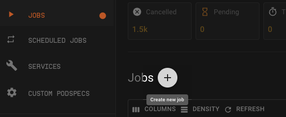
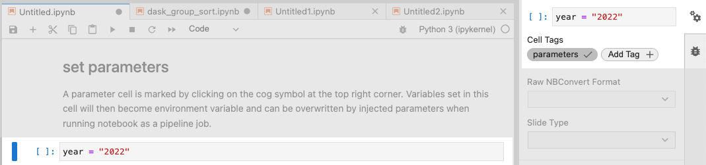
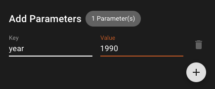

# Jobs - Test & Deploy

Pipelines are used to run a sequence of scripts from beginning to end. On Shakudo Platform you can build pipelines from VSCode notebooks, python files, or Jupyter notebooks. 

The main components of each pipeline job are the steps, parameters, pipeline YAML, scheduling, saving files, timeouts, submitting and checking jobs with GraphQL, and the outputs.

---

## Get started with jobs

If you would like to use our example code and pipeline follow our [simple pipeline job tutorial](/docs/tutorials/getstarted.md)

**Pre-requisites**
- Have a script that can run beginning to end without errors.

1. Create a pipeline YAML

  Create a .yaml file to outline the pipeline operation. Read the [YAML section](#yaml-creation) for more details. Below is an example of a one step pipeline job.

  ```yaml
  pipeline:
    name: "Example pipeline"
    tasks:
    - name: “First step”
      type: "jupyter notebook"
      notebook_path: "notebook_1.ipynb"
      notebook output path: "output_notebook1.ipynb"
  ```

  Make note of the .yaml file path

2. Navigate to the jobs tab and click on the **+** button to create a new job

  

3. Customize the details

  For detailed description of each field see [configurations](#configurations). 
  Paste in the pipeline YAML path from step 1

4. Click **CREATE**

  Once you created your job, you can see the status and access logs and details from the Jobs tab on the platform. 

---

## Job creation configurations

### Name

By default every job has an automatically generated name. You can edit this name by editing the "Name" field in the job creation dialogue.

### Job Type

"Job type" is equivalent to podspec. Choose the most appropriate "Job Type" for your pipeline job. 
See [podspecs](/docs/shakudo-platform-features/podspecs.md) for more details.

### Timeout

"Timeout" is the maximum time that the pipeline may run, starting from the moment of job submission. Even if the job is never picked up (due to resource limits or task limits set by your admin team), it will throw a timeout error after this time is reached. 

The unit is in seconds. To never timeout use `-1`.

### Active Timeout

The "Active timeout" is maximum time that the pipeline may run once it is picked up. Regardless of whether steps remain to be completed, the pipeline will stop when this timeout is reached. "Active timeout" is set as part of the submission query using the `activeTimeout` field. 

The unit is in seconds. To never timeout use `-1`.

### Max Retries

This field specifies the maximum number of attempts to run your pipeline job before returning an error, even if timeouts are not reached.

### Branch Name & Commit ID

You can choose to use scripts from a particular Git branch or commit as long as both the pipeline yaml file and the pipeline scripts are on the same branch/ commit. 

To use a specific branch, specify the name of the Git branch to use in the "branch name" field.

To use a specific commit, specify both the Git branch name and the full commit ID to use for the job.

### Pipeline YAML path

Specify the path to the .yaml file to use to run this pipeline job. Ensure that the file exists and is committed to the branch that you will be using for the pipeline job. The "pipeline YAML path" should be relative to the top directory of your repository.

### Parameters

"Parameters" are useful for experimentation, or when you want to run the same pipeline with different variables. For example, you may want to submit a query multiple times, with different values for your parameters each time. To do this you don't have to change the original script. You can specify the key value pair in the job creation tab to overwrite the values in the script. 

To setup the "parameters" functionality follow the corresponding setps:

**For jupyter notebooks**

To prepare your notebooks to receive parameters, select the cell that contains the variable you would like to parameterize. Then click on the cog icon on the top right corner. Add a tag called `parameters`. Whatever variable you would like to parameterize, add this tag to the corresponding cell. 



Then in when you are creating a job, in the **Add Parameters** field, specify the parameter key and the value you would like to overwrite with. 



Once you submit a query with the parameters field, the pipeline will insert an extra cell containing the parameter values from your job submission query.

For example, the job submission query above would insert a cell containing `year = "1990"` below the cell tagged with "parameters" in each notebook step in the example_pipeline.

You can add multiple parameters by clicking on the **+** button in teh job creation dialogue.

**Other types of steps**

In Python, Javascript, Bash, or other types of steps (including Jupyter notebooks), parameters can be accessed through environment variables. For example, using the job submission query above, one could access the new year parameter with the following line:

```python
year = os.environ.get('HYPERPLANE_JOB_PARAMETER_PARAM1') if os.environ.get('HYPERPLANE_JOB_PARAMETER_PARAM1') else '2022'
```

---

## YAML creation

Shakudo Platform Jobs and Services depend on a pipeline YAML to run. A Pipeline YAML file is a reciepe for how the pipeline should be executed. 

A sample pipeline YAML:

```yaml
pipeline:
name: [name of your pipeline job]
tasks:
	- name: “step1”
	  type: type of file
	  notebook_path: path to notebook
	  notebook output path: output notebook location
	  depends_on : run steps in parallel or specify dependencies
```

Add a Jupyter notebook step by adding the following block to your YAML file:

```yaml
  - name: "[your_step_name]"
    type: "jupyter notebook"
    notebook_path: "[notebook/path/relative/to/top/level/of/repo.ipynb]"
    notebook_output_path: "[some/notebook_output_name.ipynb]"
```

Add a Python/VScode step by adding the following block to your YAML. The script should be runnable with `python [py_path]`:

```yaml
  - name: "[another_step_name]"
    type: "vscode notebook"
    py_path: "[py/file/relative/to/top/level/of/repo.py]"
```

Add a Javascript step by adding the following block to your YAML. The script should be runnable with `node [js_path]`:

```yaml
  - name: "[another_step_name]"
    type: "js script"
    js_path: "[js/file/relative/to/top/level/of/repo.js]"
```

Add a bash script step by adding the following block to your YAML. The bash script should be runnable with `bash [bash_script_path]`:

```yaml
  - name: "[another_step_name]"
    type: "bash script"
    bash_script_path: "[sh/file/relative/to/top/level/of/repo.sh]"
```

To run scripts in parallel use `[]` in the field `depends_on`. `[]` signifies no dependency i.e. the step will run at the beginning of the pipeline job. If all steps have `[]` then all steps would run in parallel.

```yaml
	- name: “step1”
	  type: type of file
	  notebook_path: path to notebook
	  notebook output path: output notebook location
	  depends_on : []
```

---

## Debug a pipeline job

To debug your pipeline job follow the following steps:

### Connect your IDE to a pipeline job

1. From the Shakudo Platform dashboard jobs tab, start a new job by pressing the **+** button.

2. Toggle on the Debug setting. Notice that the change is automatically reflected in the GraphQL query as well: `debuggable: true`

3. Specify the pipeline yaml path as any other job and press Create.

4. Once the job is created from the list of jobs in the dashboard click on the three dots to expand the menu and find the option `<> Connect Debugger`.

5. Click the button to have the ssh command to connect your job to your IDE copied onto your clipboard.

6. Open your IDE such as VSCode. Make sure that you have the Remote SSH extension installed. If not connect using instructions on the [Sessions page](/docs/shakudo-platform-features/sessions.md/#toconnecttoyoursessionviassh).

7. Navigate to the Remote Explorer tab (if using VSCode, if not navigate to where you would add remote development ssh connections).

8. Add ssh target by clicking on **+** button and pasting the ssh connection command in your clipboard. Once you hit enter it will prompt you to specify where to save. Select the config file which you would like to update.

9. Once the host is added you should see that the jobs root folder is added to the list of folders under your ssh targets.

10. Click on the open file icon to open an ssh host in a new window. Notice in your terminal that it has routed to the main root folder of your pipeline job.

### Debug your pipeline job

1. You can use the VSCode UI set breakpoints by clicking to the left of the line number you would like to add the breakpoints to. The added breakpoints will be indicated by a red dot. Make sure you have the Python extension installed - this only has to be done once however, if the config file is deleted then you would have to install again.

2. Once the breakpoints are added, navigate to the drop down beside the icon to run the python file at the top right of your window. From there select Debug Python File.

3. You can now use the UI to debug by running the job line by line.

4. If you would like to stop the current debugging session but would like to be able to connect to the job again, click the bottom left SSH: [name.de.hyperplane.dev](http://name.de.hyperplane.dev) and click close remote connection.

5. If you want to stop the debugging completely, then type in stop_debug in your terminal. The ssh connection will be terminated and the job will be marked as done on the Shakudo Platform dashboard (i.e. you will not be able to connect back to this job again. To debug again you will need to create a new debug job).

---

## Trigger a job

Pipeline jobs can be triggered to run from external events and services. To see available triggers check this page for a full list: https://keda.sh/docs/2.5/scalers/

To set a custom trigger for your pipeline job, follow the steps below.
1. Navigate to the jobs tab on platform
2. Click on the **+** button to create a new job
3. Fill in the details
4. To set a trigger, click on the **+** button beside Custom Trigger
5. Input the trigger specifications. You can find various trigger specifications on https://keda.sh/docs/2.5/scalers/ . Click on a trigger you’d like to use and copy and paste the specifications. Edit the details as needed. 
6. Click **Create**

---

## Schedule a job

Pipeline jobs can be set to run on a schedule. This is particularly useful when you want to process data in batches. 

To schedule a job, follow the steps below.
1. Navigate to the scheduled jobs tab
2. Click on the **+** button to create a scheduled job
3. Fill in the details:
Name: Give your job a descriptive name or use the auto generated name
Job Type: Choose which podspec your job uses
Timeout: This refers to the global timeout which is the maximum time that the pipeline may run, starting from the moment of job submission. Even if the job is never picked up (due to resource limits or task limits set by your admin team), it will throw a timeout error after this time is reached. 
Active Timeout: The active timeout is the maximum time that the pipeline may run once it is picked up. Regardless of whether steps remain to be completed, the pipeline will stop when this timeout is reached.
Max retries: 
Schedule: This is where the schedule is set. Our scheduler uses cron expressions. See https://crontab.guru/ for example expressions. 
E.g. `*/30***` translates to every 30 minutes 
Pipeline YAML Path: The path to your pipeline YAML for the scheduled job
Add Parameters Key: the parameter that is used in your script
Add Parameters Value: value you’d like to overwrite with for the key
4. Click **Create**


