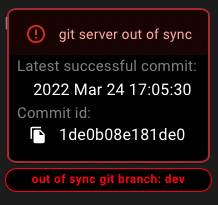
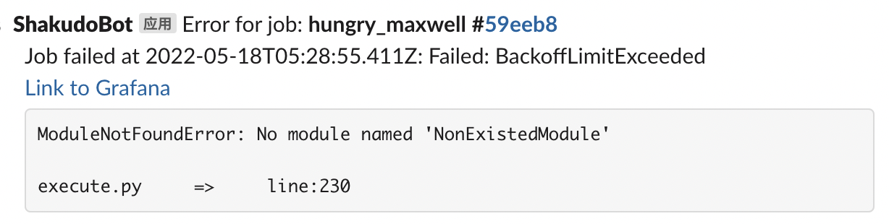

# Monitoring

## Git sync

Clusters have a git repository where the scripts and pipeline YAMLs are stored for development and running jobs. The cluster maintains an active healthy synced copy of the repository that it uses to run pipeline jobs. This means the copy of the repository will no longer be in sync if there was a bad commit (e.g. a large file being committed to the repository).

There is a git sync status indicator located at the left corner of the Shakudo Platform. When it is in sync the git status would read in-sync and hovering over the indicator would show you when the status was last checked in the tool tip. When there was a bad commit and the git repository is no longer in sync the indicator would turn red and show git out of sync. Hovering over the indicator would display the last healthy sync time and commit ID. 

A healthy git server indicator:

 

Out of sync git server:

To get it back to a healthy status go to the git repository and search for the latest healthy sync. The subsequent commit will be the problematic commit. There are a number of reasons why a commit may be unhealthy. A few common reasons are:
* a large file has been committed
* the project is referencing another git project

## Slack Alerts

Slack alerts are available for failed or timeout jobs. Slack messages are sent when all retries have failed. To get Slack alerts set up you must [contact our customer success team](mailto:info@shakudo.io). 

Many teams set up a dedicated Slack channel to send alerts to. Wherever you would like the alerts sent, once you have the channel setup follow the steps below (for more detailed guide by Slack on getting a webhook URL check this page)

1. Create a new Slack app in the workspace you want to the Shakudo Platform messages to be posted
2. From Features page, toggle on Activate Incoming Webhooks
3. Click **Add New Webhook to Workspace**
4. Pick a channel that you would like the notifications in, then click **Authorize**
5. Send the Shakudo customer success team your Slack Incoming Webhook URL to start getting job failure notifications.

The Shakudo Slack bot will post a message for any errored or timed out jobs. The message will include:
- Job name
- Job ID
- Timestamp of failure or timeout
- Reason for failure
- Link to Grafana logs for the job
- A snippet of the specific error message

A preview sample message:

