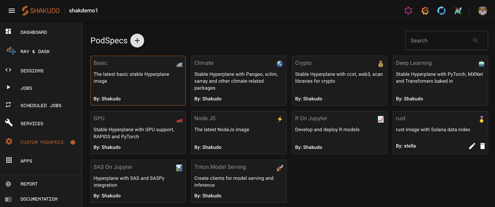
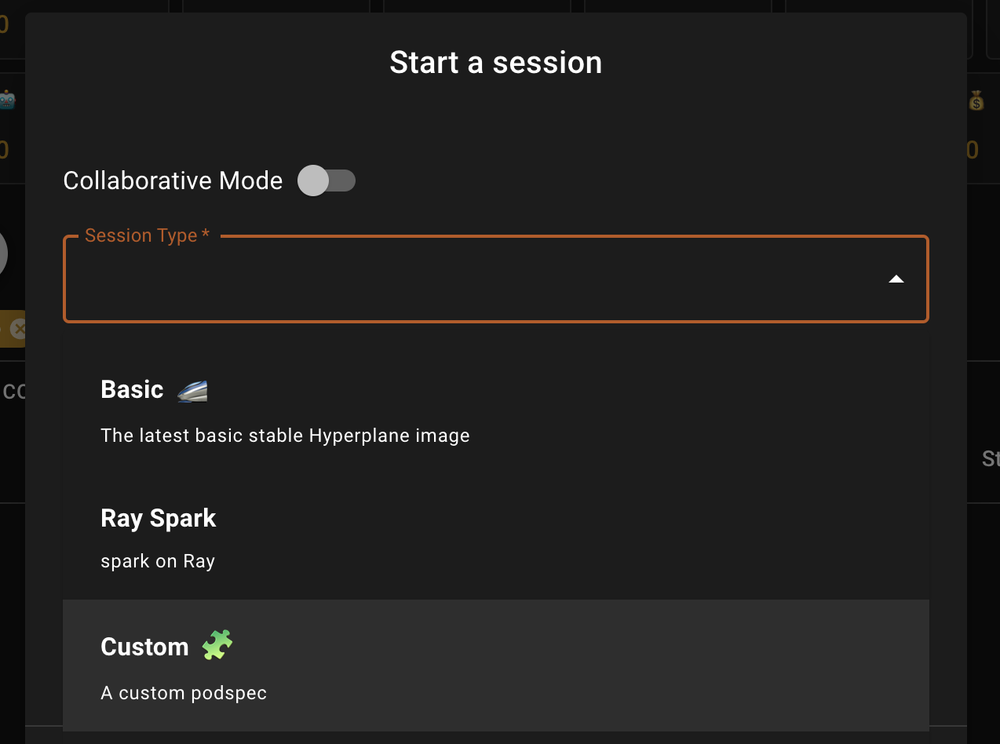

# PodSpecs

Sessions has a variety of fully managed Jupiter environments for developing VSCode notebooks, python files, and Jupyter notebooks.

To spin up a Sessions instance, go to the **Sessions** tab on the dashboard and start a new session.

Below is a list of pre-built for a quick start. 

| Display Name         | Image Name   | Best For    |Key Packages                         |
| :----------------| :----------- | :-----------|:----------------------------------- |
| Minibasic        | minibasic    | basic data processing | numpy, pandas |
| Basic            | basic        | data science | numpy, scipy, scikit-learn, Dask     |  
| Deep learning    | dl           | deep learning      | TensorFlow, Pytorch, MXNet, transformers    |
| GPU              | gpu          | machine learning with GPU | Rapids TensorFlow Pytorch |
| Triton model serving | triton  | model serving with triton | tritonclient           |
| Ray Spark        | rayspark     | data engineering with spark on ray | Ray raydp Spark|
| Ray              | ray          | distributed training, hyperparameter tuning | Ray  |
| Crypto           | crypto       | crypto trading and DApps | ccxt web3   |
| Climate          | climate      | large scale climate data processing  | xclim Pangeo xarray |
| SAS on Jupyter   | sas          | run sas code in jupyter and integrate with python | saspy   | 
| R on Jupyter     | rstat        | run R code in jupyter and integrate with python | rstat|   
| Rust             | rust         | building DApps | rust, cargo, SOL SDK|   
| Custom           | custom       | use your own Docker image | - |   

---

## PodSpec details

To check the configurations for each podspec navigate to the podspec tab and click on the podspec card you'd like to see the details for.

### Check installed packages

To check what packages are installed in a podspec type, you can do so from Sessions. 

1. Create a [new session](/docs/shakudo-platform-features/sessions.md/#get-started-with-sessions) and choose the session type for which you'd like to check the packages for. 

2. Open up the browser Session and open a Jupyter notebook.

3. Type in `pip freeze` to see pip packages installed and `conda list` for conda packages installed.

---

## Create a podspec

### Prerequisities

These are a few requirements when creating a podspec:

* An image that is accessible to Shakudo
* Volumes and volume mounts to exist
* Appropriate node pools or resources

### Steps to create a podspec

You can create a new podspec to use in your Sessions, Jobs, or Services.
Follow the steps below to do so:

1. Navigate to the podspecs tab and click on the **+** button to create a new podspec

2. Customize the details. For details on each field, see the section below for [podspec configurations](#podspec-configurations)

3. Click **CREATE**

4. To view and use the new podspec you must press `⌘` + `R` to hard refresh the page.

---

## Podspec configurations

### Name

This is the name that will show up when choosing which podspec to use in Sessions, Jobs, and Services.

### Podspec name

This name acts as a unique ID for the podspec.

### Description

Give the podspec a one liner description for when someone should pick it. This description appears in the podspec page as well as in the Session Type selection.

### Icon

The icon is a quick way to identify your podspec. Choose any icon by clicking on the smiling face button on the right side of the field.

### Image URL

You can choose to bring your own docker image to build your custom podspec with. Paste in the link to the image in this field. For more information on how to build your own image that is compatible with the Shakudo platform check out the [advanced guide on custom images](/docs/advanced%20guides/customimage.md).

### Resources

You can specify the CPU request & limit as well as the memory request & limit.

If you want GPUs make sure to specify GPUs that are available to your cluster. If you're unsure please contact us and we can provide you the details.

### Volumes & volume mounts

Specify your Volumes and Volume Mounts to attach by clicking on the **+** button. For more information see the [Kubernetes guide on Volumes](https://kubernetes.io/docs/concepts/storage/volumes/).

### Environment variables

Use this field to specify the name and value for environment variables.

---

## Edit a podspec

You can edit details of a podspec by clicking on the pencil icon from the podspec tab. By default you can only edit the custom created podspecs (**not** the default podspecs created by Shakudo)

When a podspec is edited and saved, newly created jobs and sessions will use the updated version. Any jobs or sessions currently in progress will use the old version. Any services in progress using the edited podSpec will be restarted to update.

