# Sessions - Develop your scripts

A Session is a development environment that comes with pre-configured environments for various builders. You have the ability to customize your environment by bringing in your own Docker image or creating your own podspecs.

Each pre-built environment comes with the most relevant packages pre-installed with the appropriate machines.

You can use Sessions in your browser or locally by connecting to your preferred IDE by establishing an SSH connection. 

## Get started with Sessions
1. To start a session navigate to the Sessions tab on the left menu bar.
2. Press the **+** button
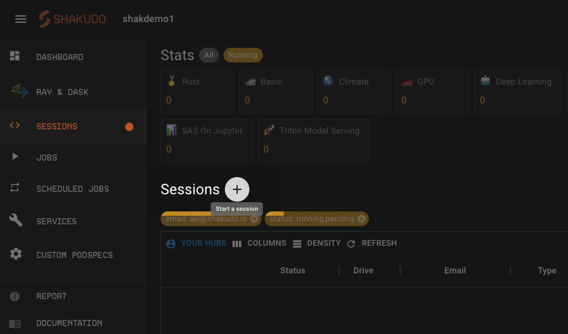
3. Choose which type of session you’d like to use as your development environment
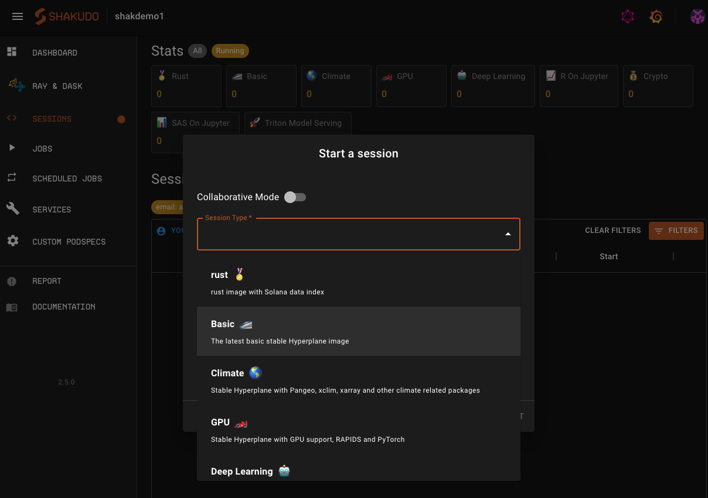
4. Click **Start**. The session spin up may take a few seconds to a few minutes depending on your session type.
5. Once your session is ready click the expand button to access your session on your browser.


---

## Configurations

### Session Type


The session type that you choose in the session creation popup will prepare your Session with a pre-configured development environment. Relevant packages, frameworks will be pre-installed and the environment will come with relevant machine types.

Details on what resources volumes and YAML is used for each of the session types can be found by navigating to the Custom PodSpec tab on the Platform and clicking on the card for more details. 

Contact us for any images that we do not currently support 

### Collaborative Mode

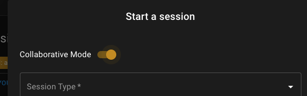

Toggling on collaborative mode in the Session creation popup enables real-time collaboration between multiple users inside a jupyter notebook. With this feature enabled, you’ll be able to see collaborating users’ cursors when working together. 

To allow other Shakudo Platform users to access your Session send the collaborating user can launch your Session by navigating to the Sessions tab, remove the email filter and click on the expand icon to launch the Session. If you send the collaborating user your Session URL displayed in your browser, add `?token=hyperhub` at the end of the URL address. Alternatively if you send them the link without the ending they’ll be prompted to enter a token for authentication where they can enter `hyperhub` to access your Session.  

This setting is only supported for Sessions used in your browser JupyterLab Session (Not available as part of SSH remote Session). Note that sync works when the collaborating users are accessing the document from the same editor in JupyterLabs. For example, a notebook can be opened using the Notebook editor or plain text editor. 

Note that other users are able to access your Session without the collaborative mode turned on but they will not be able to see the cursors. Additionally if both users edit and save their documents a warning message indicating the file has been changed will be displayed.

### Timeout

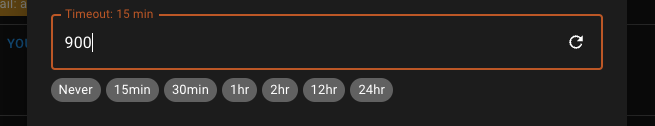

Set the Session timeout to however long you would like your Session to be live for. The time is set in seconds. Never is set as `-1`.

For in browser Sessions this will be an idle timeout: time from when you were last active till when your Session will automatically shut down. 

For SSH remote connected Sessions we won’t be able to detect your live activity thus this timeout is an absolute timeout: your Session timeout from the moment of Session spinup.

We do not recommend using Never except for remote Sessions.

### Drive Name - Spinning up multiple Sessions

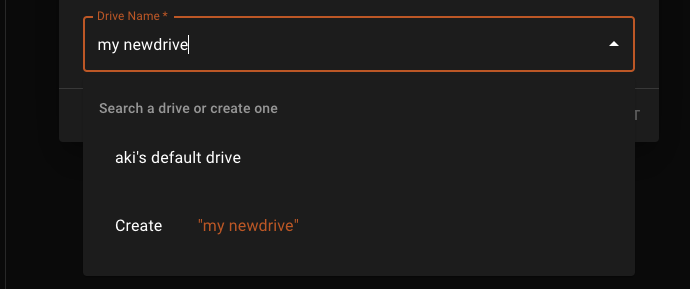

Each Session is connected to a drive containing your files and folders. Each user has a default drive. Users can spin up multiple sessions by selecting a new drive or creating one if all drives are in use. To create a drive type a new name for your drive in the drive name box in the Session creation popup. Then click the **Create** button that appears in the dropdown. Click **Start** Session to use the new drive. 

Depending on your git repository settings the newly created drive may be empty. To populate your drive with the files from your git repo, open the terminal on the browser JupyterLab Session. The input the following command.

```$ssh-keygen 
$cat ~/.ssh/id_rsa.pub 
# go to your git provider (github/bitbucket/gitlab and add the ssh key to your bitbucket ssh key list, so it can read write
```

Then go to your git provider (github/bitbucket/gitlab and add the ssh key generated in your terminal to your bitbucket ssh key list, so it can read and write. Then clone your git repository to your new drive using the SSH option. 

---

## To connect to your session via SSH

You can use Sessions from VSCode or any of your preferred IDE through SSH connection.

### First time device registration:

1. To use VSCode with ssh, install [VSCode Remote - ssh](https://marketplace.visualstudio.com/items?itemName=ms-vscode-remote.remote-ssh) extension to your VSCode.

2. Generate a ssh key pair for your local machine (`ssh-keygen -t ed25519` or skip if you already have `~/.ssh/id_ed25519` and `~/.ssh/id_ed25519.pub` files)

3. In Shakudo Platform dashboard, click the profile button (right top) and click the **Register device** button in your profile submenu:

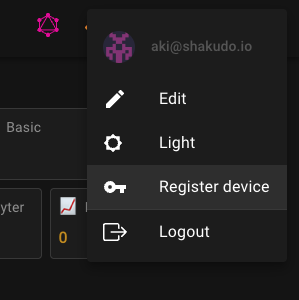

4. From the popup window, copy the ssh invite command

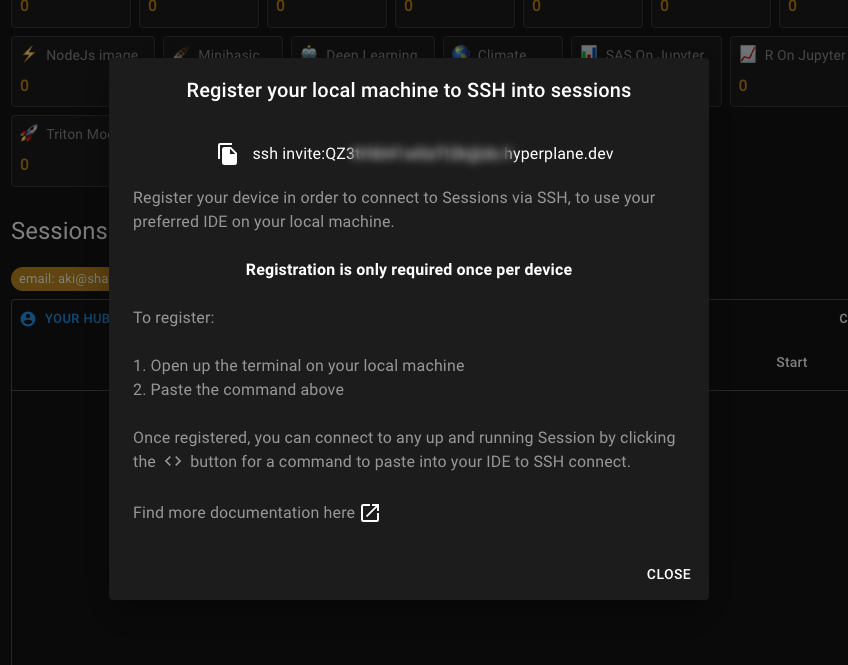

5. Paste and run the ssh invite command in your local machine's terminal

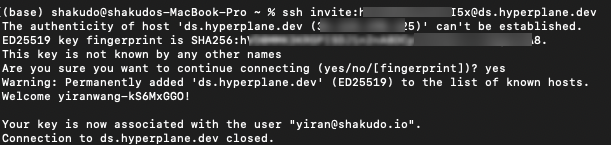
    
6. You should now able to connect the session by ssh. (See [SSH connect to a registered device](#ssh-connect-to-a-registered-device))

:::note
The step above is required only once per device. After registering your device once follow the steps below.
:::

### SSH connect to a registered device

1. Start a Shakudo Platform Session if you haven't already. For SSH connected Sessions the [timeout](#timeout) is absolute timeout: time from spin up to Session end. If you're unsure how long you'd be using the Session, choose a long period of time (e.g. 12hrs)  or Never (-1) and remember to manually shutdown your Session after finishing up.

2. Copy the ssh command from your Sessions dashboard by clicking on the **< >** button for your the specific Session you created.

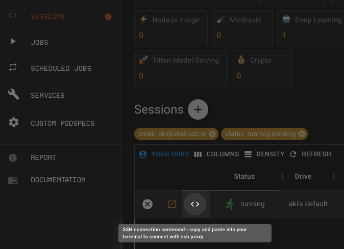 

3.  **For VSCode Remote**  
    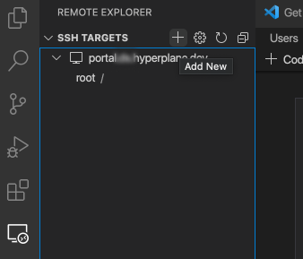 

    Add an SSH target in your VSCode Remote Explorer. Paste the printed ssh command from above. Check that there are no other entries with the same IP as the above in your ssh config file .

    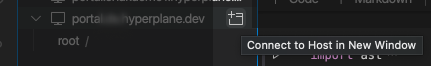

    Once the SSH target is added click on the new window icon to open the remote Session. You can check that you are properly connected by opening the terminal in your SSH connected VSCode and checking that you have all the files you would see in your browser session. 

    **For SSH from terminal** 
    Paste the ssh command into a terminal on your local machine to connect to Sessions via ssh.  
    Check that you are in the conda "base" environment with `conda activate base`. 

### Troubleshooting
1. Ensure your local key file has `700` permissions.(`chmod 700 ~/.ssh/id_ed25519`). Also ensure your Sessions `~/.ssh` folder has `700` permissions with
    
    ```
    chmod 700 ~/.ssh
    chmod 700 ~/.ssh/*
    ```

2. Ensure your `~/.ssh/config` does not have another entry with the same IP or Hostname as the command from above.

3. If you are still having issues, consider deleting your `~/.ssh/authorized_keys` file from your Sessions and restart from "Register your machine".

4. If you see the following warning:
    ```
    @@@@@@@@@@@@@@@@@@@@@@@@@@@@@@@@@@@@@@@@@@@@@@@@@@@@@@@@@@@
    @    WARNING: REMOTE HOST IDENTIFICATION HAS CHANGED!     @
    @@@@@@@@@@@@@@@@@@@@@@@@@@@@@@@@@@@@@@@@@@@@@@@@@@@@@@@@@@@
    IT IS POSSIBLE THAT SOMEONE IS DOING SOMETHING NASTY!
    Someone could be eavesdropping on you right now (man-in-the-middle attack)!
    It is also possible that a host key has just been changed.
    ```
    Remove the ssh known host by: `rm .ssh/known_hosts`
    Then start from the register your device step.