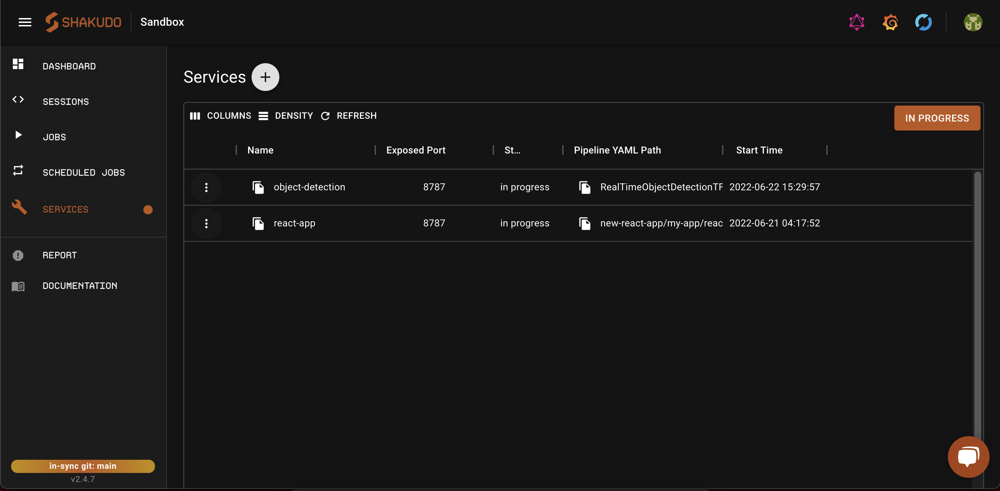
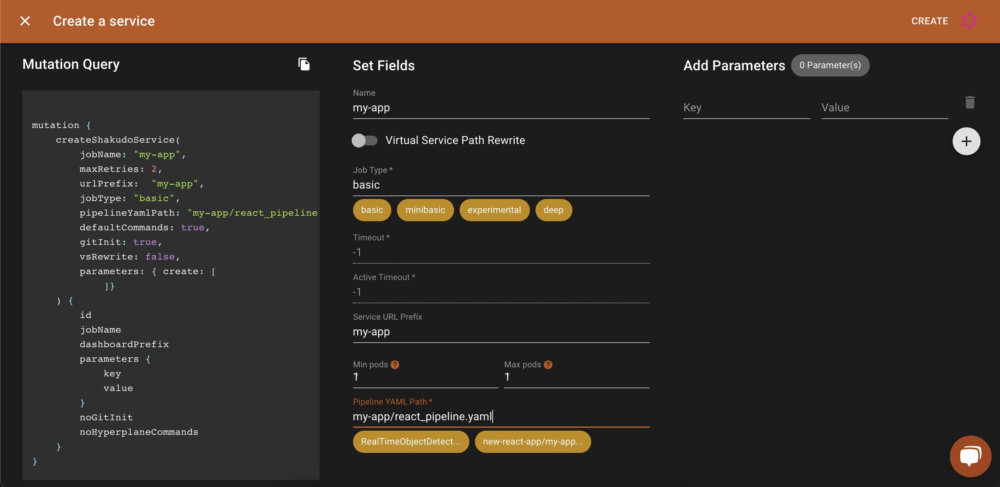

# Create a React App

You can create a React application on the Shakudo Platform as a service. Follow the steps below to get started!

## 1. Prepare your environment 

1. Start a [Session](/docs/shakudo-platform-features/sessions.md) with the NodeJs image
2. Open your sessions and check your node version using: `node —version`
3. Install `npx` using `npm install npx`
4. Create a React app using `npx create-react-app my-react-app`


## 2. Create a pipeline yaml
Create a .yaml file to list your steps. You can start with adding the following template to `react_pipeline.yaml`:  

```
pipeline:
  name: "Example pipeline"
  tasks:
  - ...
```

Add a Bash script step by adding the following block to your YAML. The Bash script should be runnable with `bash [bash_script_path]`. This will install the dependencies and start your Node server:
```
  - name: "[another_step_name]"
    type: "bash script"
    bash_script_path: "[sh/file/relative/to/top/level/of/repo.sh]"
```

An example bash script to start your React application is:

```
PROJECT_DIR="$(cd -P "$(dirname "${BASH_SOURCE[0]}")" && pwd)"
cd "$PROJECT_DIR"

yes Y | curl -sL https://deb.nodesource.com/setup_14.x | bash -
apt update
apt install nodejs
npm install
npm start
```

## 3. Edit your `package.json` to host your React app

When you want to host a React application on the Shakudo platform you have to specifiy the homepage of your application. This will be the root domain plus the the prefix which will host your React application. 

You should also set your host as 0.0.0.0 and the port as 8787 on your start script, and turn of VS Rewrite.

An example `package.json` file:
```
{
  "name": "my-react-app",
  "version": "0.1.0",
  "private": true,
  "homepage": "https://[CLUSTER_NAME].hyperplane.dev/[my-app]/",
  ...
  "scripts": {
    "start": "HOST=0.0.0.0 PORT=8787 react-scripts start",
    "build": "react-scripts build",
    "test": "react-scripts test",
    "eject": "react-scripts eject"
  },
  ...
}
```

:::note
The [my-app] prefix should match the dashboard URL prefix when creating your service in step 4
:::

## 4. Create your React App on the dashboard

Use the **Services** tab on the dashboard to start your React application


Set the pipeline YAML path and the endpoint for your React app. The endpoint should be the same as the one specified in previous step. Also turn off the Virtual Service Path Rewrite.


Then click **Create** on the top right corner. You React App should appear in the services tab in the dashboard.

:::danger Important notes when cloning other git repositories
* Exclude the `node_modules` folder when committing your code to your Shakudo repository
* Remove the `package-lock.json` to avoid mismatching packages.
* Ensure that your bash script can start your React app when your run it on your session. 
:::

You can use our GraphQL mutation query in the GraphQL playground to create your React App Service. Copy the GraphQL mutation created on the left handside of the service creation dialogue or simply copy the code block below.

```json
mutation {
    createShakudoService(
        jobName: "my-react-app",
        maxRetries: 2, 
        urlPrefix:  "my-app",
        jobType: "basic",
        pipelineYamlPath: "my-react-app/react_pipeline.yaml",
        defaultCommands: true,
        gitInit: true,
        vsRewrite: false,
        parameters: { create: [
            ]}  
    ) {
        id
        jobName
        dashboardPrefix
        parameters {
            key
            value
        }
        noGitInit
        noHyperplaneCommands
    }
}
```
Open the GraphQL playground from the dashabord and paste the code above into the lefthand side and press the play button. 

* Note the the `urlPrefix` should match the dashboard URL prefix set in your `package.json` file as the homepage of your application.
