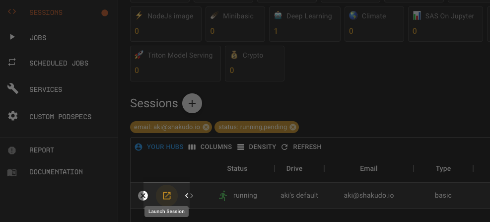
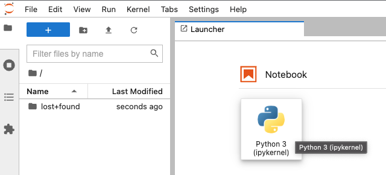

# Build & Deploy in 5min

Shakudo Platform enables you to build pipelines from VSCode notebooks, python files, or Jupyter notebooks.

In this tutorial we'll walk you through an end to end example of going from development to deployment of a simple data processing pipeline.

## 1. Start a Session

Start a Session by navigating to Sessions tab on the dashboard and clicking on the **+** button. 
You will see a popup to Start a Session. Choose `Basic` from the Session Type drop down. For more information on Session Types and other configurations check out the [Guide on Sessions](/docs/shakudo-platform-features/sessions.md)

## 2. Open a notebook

Once the Session is ready you'll see an expand icon click on it to open a Jupter lab browser Session.



In your browser Session choose the Python 3 Notebook option.



## 3. Process data with Pandas

The example we are going to use will use be a **group-by** task on a public flight dataset in AWS S3 bucket. The dataset has 22 CSV files and is 11GB in total.

```python
import pandas as pd
df_pd = pd.read_csv("s3://dask-data/airline-data/1990.csv", 
          usecols = ['DepTime','FlightNum','DepDelay','Origin', 'Dest','Distance'])
df_sort_pd = df_pd.groupby('Origin').apply(lambda x : x.nlargest(n = 10, columns = 'Distance'))
```

The `1990.csv` data shape is `(5270893, 6)` and the processing time of the above operation is 21s on a 16 CPU 16G RAM machine. Now we want to scale up the above computation for **10** CSV files for 1990 to 1999. On one 16 CPU 16G RAM machine it will cause an `out of memory error` and crash the kernel. To process the files one by one, in total the operation is estimated to take **3.5 minutes**. As a workaround and to speed up computation we'll be using Dask.

## 4. Spin up a Dask Cluster

Now let's spin up a distributed Dask cluster and speed up the computation!

The easiest way to get started is by using the [`notebook_common`](../shakudo-platform-features/api/dask.md) function to spin up a pre-configured Dask cluster. You can specify the number of workers with argument `num_workers` or specify more specs to better fit your computation. Shakudo Platform will automatically choose a cluster configuration for you and provides a Dask dashboard link to monitor progress.

```python
from hyperplane import notebook_common as nc
client, cluster = nc.initialize_cluster(
        nprocs=5,
        nthreads=3,
        ram_gb_per_proc=2.4,
        cores_per_worker=15,
        scheduler_deploy_mode="remote",
        num_workers = 3
    )
```

You will be able to see the spinning up logs of the Dask cluster and the link to the Dask dashboard.

```python
👉 Shakudo Platform: selecting worker node pool
👉 Shakudo Platform: selecting scheduler node pool
Creating scheduler pod on cluster. This may take some time.
👉 Shakudo Platform: spinning up a dask cluster with a scheduler as a standalone container.
👉 Shakudo Platform: In a few minutes you'll be able to access the dashboard at https://ds.hyperplane.dev/dask-cluster-e002f3d0-b18d-4027-81c5-bed613eb63a4/status
👉 Shakudo Platform: to get logs from all workers, do `cluster.get_logs()`
```

## 5. Process data in Dask

To run the code from step 3 on a Dask cluster, we just need to swap the Pandas API to Dask API, which is very similar. Dask does lazy computation, the last line `df_sort.compute` triggers the computation. You can find information on the Dask concepts and Dask best practices page. Check out the [Dask offcial documentation](https://docs.dask.org/en/) for more.

```python
df = dd.read_csv(data_url, 
                 storage_options = {'anon': True},
                 usecols = ['DepTime','FlightNum','DepDelay','Origin', 'Dest','Distance'],
                 dtype={'Distance': 'float64',
                    'DepTime':'float64',
                    'FlightNum':'int64',
                    'DepDelay':'float64',
                    'Dest':'object',
                    }, 
                encoding = "ISO-8859-1")
df_sort = df.groupby('Origin').apply(lambda x : x.nlargest(n = 10, columns = 'Distance'))
df_sort.compute()
```

The above Dask operation took **18.8 seconds** using 3 remote 16 CPU 16G RAM Dask nodes.

After using Dask it's good practice to close the cluster atfer use. Add the line below at the end of your notebook:

```python
cluster.close()
```

## 6. Automate the job with Shakudo Platform Jobs

Now the data processing notebook is developed and tested, to automatically run this notebook on a schedule as in most production setups, we can simply add a pipeline.yaml file to build a pipeline. To read more on pipeline YAML files please visit the [create a pipeline job page](/docs/shakudo-platform-features/jobs.md/#getstartedwithjobs).

Open a text file on your browser Session by clicking on the blue **+** button on the top left of the side bar. 

Copy and paste the yaml below:

```python
pipeline:
  name: "data prep pipeline"
  tasks:
  - name: "Dask groupby data"
    type: "jupyter notebook"
    notebook_path: "pipeline_job/dask_group_sort.ipynb" #Edit this path to where the notebook is stored
    notebook_output_path: "dask_group_sort_output.ipynb" 
```
:::note
Once you are happy with the pipeline yaml and the notebook, make sure to commit and push them to the synced git repo. 
:::

## 7. Productionize the notebook by launching a job on Shakudo Platform

Now we are one step away to put the job in production! To launch a pipeline job, we can go to the Shakudo Platform dashboard's Jobs tab and click **Create**.

Once the job creation dialogue pops up we paste in the path to where the pipeline .yaml file is located in the corresponding Pipeline YAML Path field. 

Click the **CREATE** button on the top right corner.

Once the job is created, we are officially alive in production!

## 8. Additional Steps
Shakudo Platform offers a variety of other functionalities for more advanced workflows. Some additional uses include the following:

* [Run pipelines on a schedule](/docs/shakudo-platform-features/jobs.md/#scheduleajob)

* [Submitting/ triggering pipeline jobs](/docs/shakudo-platform-features/jobs.md/#triggerajob)
